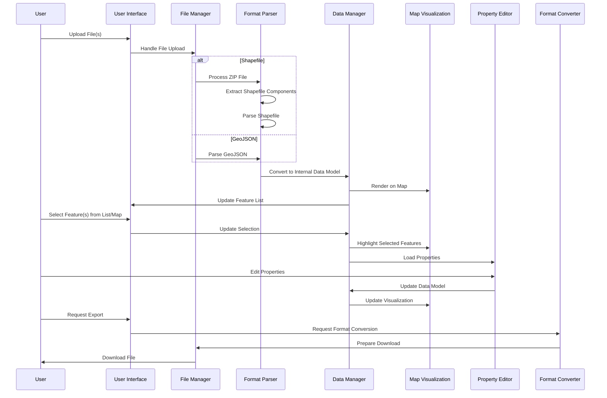

# GeoConverter Web Application Architecture Plan

## 1. Application Overview

GeoConverter is a web-based GIS file converter application that enables users to:
- Import GIS data in Shapefile (.zip) format.
- Visualize geographic data on an interactive map
- Edit feature properties with multi-select capability
- Export data GeoJSON

The application will be entirely client-side with all processing happening in the browser.

## 2. Technology Stack

### Frontend Framework
- **React**: For building the user interface with component-based architecture

### Map Visualization
- Do not use MapBox GL

### Supporting Libraries
- **shpjs**: For parsing Shapefiles in the browser
- **JSZip**: For handling zipped Shapefile components
- **Turf.js**: For geometric operations and analysis
- **Material UI** or **Ant Design**: For UI components and styling

## 3. User Interface Layout

### Fixed Three-Panel Design

```
+------------------------------------------+
|  GeoConverter            Version: 0.1    | <- Header with version
+----------+-------------------+-----------+
|          |                   |           |
| Upload   |                   | Property  |
| Section  |                   | Table     |
|          |                   |           |
|----------|                   |-----------|
|          |                   |           |
| Feature  |      Map View     | Editing   |
| List     |                   | Controls  |
| (Hier-   |       [+] [-]     |           |
| archical)|       [🏠] [🔍]    |-----------|
|          |                   |           |
|----------|                   | Styling   |
|          |                   | Options   |
| Export   |                   |           |
| Controls |                   |           |
|          |                   |           |
+----------+-------------------+-----------+
```

### Panel Details

#### Header
- Minimal design with application name on the left
- Version number (x.x format) displayed at the bottom right
- Manual version updating through configuration

#### Left Panel (File & Features)
- **File Upload Section**:
  - Drag-and-drop area
  - File format indicators
  - Upload button
  - File status/info display

- **Feature List**:
  - Simple hierarchical structure
  - Expandable/collapsible levels
  - Selection checkboxes for multi-select
  - Visual indicators for selected features
  - Feature type icons (point, line, polygon)

- **Export Controls**:
  - Format selection dropdown (Shapefile, GeoJSON)
  - Export button
  - Optional format-specific settings

#### Center Panel (Map Visualization)
- **Map Display**:
  - Full-sized map rendering
  - Visual highlighting of selected features

- **Floating Controls**:
  - Zoom in/out buttons
  - Home/reset view button
  - Layer visibility toggles
  - Selection tools (rectangle, lasso)
  - Base map selector

#### Right Panel (Properties & Editing)
- **Property Editor**:
  - Table-based layout with property names and values in columns
  - Editable cells for values
  - Add/remove property functionality
  - Indication for mixed values when multiple features selected

- **Bulk Editing Tools**:
  - Controls for updating multiple features simultaneously
  - Selection statistics and information

- **Style Options**:
  - Color selection for features
  - Line width controls
  - Fill pattern options
  - Opacity/transparency settings

## 4. Data Flow & Processing



### Internal Data Model
- Unified representation of geographical features regardless of source format
- Support for feature properties, geometry, and styling information
- Efficient data structure for selection operations

## 5. Component Structure

```
App/
├── Header/
│   ├── AppTitle/
│   └── VersionDisplay/
├── MainContent/
│   ├── LeftPanel/
│   │   ├── FileUploader/
│   │   ├── FeatureList/
│   │   │   ├── FeatureGroup/
│   │   │   └── FeatureItem/
│   │   └── ExportControls/
│   ├── MapPanel/
│   │   ├── MapView/
│   │   └── MapControls/
│   │       ├── ZoomControls/
│   │       ├── LayerControls/
│   │       └── SelectionTools/
│   └── RightPanel/
│       ├── PropertyEditor/
│       │   ├── PropertyTable/
│       │   └── PropertyControls/
│       ├── BulkEditTools/
│       └── StyleOptions/
│           ├── ColorPicker/
│           ├── LineControls/
│           └── FillControls/
└── Footer/
```

## 6. Implementation Strategy

### Phase 1: Layout & Basic Infrastructure (Week 1)
- Set up React application structure
- Implement the fixed three-panel layout
- Create version configuration system
- Add basic styling and component framework

### Phase 2: File Handling & Map Integration (Week 2)
- Implement file upload functionality for both formats
- Integrate MapboxGL JS for map visualization
- Create feature list with hierarchical structure
- Implement basic selection capability

### Phase 3: Data Conversion & Property Editing (Week 3)
- Integrate Shapefile and GeoJSON parsers
- Implement the table-based property editor
- Create internal data model
- Add multi-select capability

### Phase 4: Feature Refinement & Export (Week 4)
- Implement feature styling options
- Add advanced selection tools
- Create export functionality for both formats
- Polish user interface and experience

### Phase 5: Testing & Optimization (Week 5)
- Test with various real-world GIS data
- Optimize performance for larger datasets
- Enhance error handling and user feedback
- Implement final UI refinements

## 7. Project File Structure

```
geo_converter/
├── public/                # Static assets
│   ├── index.html
│   ├── favicon.ico
│   └── assets/
├── src/
│   ├── components/        # React components
│   │   ├── Header/
│   │   ├── LeftPanel/
│   │   ├── MapPanel/
│   │   ├── RightPanel/
│   │   └── common/
│   ├── hooks/             # Custom React hooks
│   ├── services/          # Core functionality
│   │   ├── fileService.js     # File upload/download
│   │   ├── shapefileService.js # Shapefile processing
│   │   ├── geoJsonService.js   # GeoJSON processing
│   │   ├── mapService.js      # Map interactions
│   │   ├── dataService.js     # Data management
│   │   └── styleService.js    # Feature styling
│   ├── utils/             # Helper functions
│   ├── context/           # State management
│   │   ├── AppContext.js
│   │   ├── MapContext.js
│   │   └── FeatureContext.js
│   ├── models/            # Data types/interfaces
│   ├── config/            # Configuration
│   │   └── version.js     # Version management
│   ├── styles/            # Global styles
│   ├── App.js             # Root component
│   └── index.js           # Entry point
├── package.json
└── README.md
```

## 8. Technical Considerations

### Performance Optimization
- Use virtualized rendering for feature lists
- Implement efficient map rendering for large datasets
- Consider web workers for heavy processing tasks

### Error Handling
- Validate files before processing
- Provide clear error messages for invalid files
- Handle gracefully when conversion loses data

### Version Management
- Store version in config/version.js
- Simple x.x format with manual updates
- Display version in header's bottom right corner

### Accessibility
- Ensure keyboard navigation throughout the app
- Provide adequate color contrast
- Include ARIA attributes for screen readers

### Future Extensibility
- Design for adding more file formats later
- Component structure that allows feature additions
- Prepare for potential backend integration